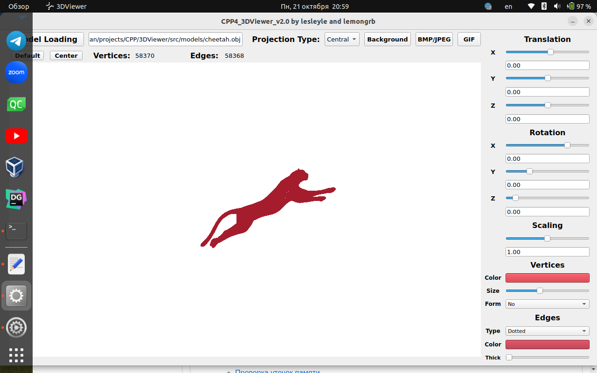

# Содержание

1. [О проекте](#о-проекте)
2. [Принципы разработки](#принципы-разработки)
3. [Графический интерфейс (GUI)](#графический-интерфейс-gui)
4. [Функциональные возможности](#функциональные-возможности)
5. [Скриншоты](#скриншоты)
6. [Используемые инструменты](#используемые-инструменты)
7. [Сборка проекта](#сборка-проекта)
   - [Установка](#установка)
   - [Запуск приложения](#запуск-приложения)
   - [Удаление установки](#удаление-установки)
8. [Тестирование](#тестирование)
   - [Запуск тестов](#запуск-тестов)
   - [Отчет о покрытии тестами](#отчет-о-покрытии-тестами)
   - [Проверка утечек памяти](#проверка-утечек-памяти)
9. [Очистка](#очистка)
10. [Документация](#документация)
11. [Заключение](#заключение)

# 3DViewer (3Д Вьювер)

## О проекте

**3DViewer** — это программа для визуализации 3D-моделей с поддержкой базовых аффинных преобразований. Проект написан на языке C++ и включает графический интерфейс на основе Qt. Отрисовка объектов производится с помощью библиотеки openGL. Также проект включает средства для тестирования, проверку на утечек памяти, проверку на стиль кода. 

- **Код программы**:
  - Логика работы с 3D-моделями находится в `src/back/`.
  - Интерфейс и реализация отрисовки фигур находится в `src/gui/`.
  - Модели формата OBJ находятся в папке `src/models/`.
  - Скриншоты программы находятся в папке `images/`.
  
- **Сборка**:
  - Управляется с помощью Makefile с основными целями: `all`, `install`, `uninstall`, `clean`, `dvi`, `dist`, `tests`.

## Принципы разработки

- Использовались такие паттерны проектирования, как: **фасад**, **синглтон**, **шаблонный метод**, **модель-представление-контроллер**.

Паттерн **Фасад** применён для упрощения взаимодействия между графическим интерфейсом (GUI) и внутренней логикой обработки 3D-моделей. Этот паттерн скрывает сложные внутренние механизмы работы программы, предоставляя упрощённый и единый интерфейс для взаимодействия с подсистемой, ответственной за манипуляции с 3D-моделями.

Паттерн **Синглтон** был применён для того, чтобы гарантировать, что в любой момент времени существует только один объект.

Паттерн **Шаблонный метод** был применён для реализации различных типов преобразований (поворот, масштабирование, перемещение).Используется общий шаблонный метод, который определяет последовательность шагов, но конкретные детали реализации различаются.

Паттерн **MVC** разделяет логику программы на три части:
- **Модель (Model)**: отвечает за бизнес-логику программы и управление данными. В данном проекте моделью являются данные 3D-модели и её состояние, а также логика для выполнения аффинных преобразований.
- **Представление (View)**: отвечает за отображение данных пользователю. В проекте представление реализовано через GUI, который отображает 3D-модель и её изменения.
- **Контроллер (Controller)**: отвечает за управление и обработку взаимодействий пользователя с интерфейсом. Контроллер принимает команды от пользователя (например, изменение масштаба или вращение модели) и передаёт их модели для выполнения, после чего обновляет представление.
  
## Функциональные возможности

- 1. Загрузка каркасной модели из файла формата obj (поддержка только списка вершин и поверхностей);
- 2. Перемещение модели на заданное расстояние относительно осей X, Y, Z;
- 3. Поворот модели на заданный угол относительно своих осей X, Y, Z;
- 4. Масштабирование модели на заданное значение.
- 5. Настройка типа проекции (параллельная и центральная).
- 6. Настройка типа (сплошная, пунктирная линия), цвета и толщины ребер, способ отображения (отсутствует, круг, квадрат), цвет и размер вершин.
- 7. Программа позволяет выбирать цвет фона.
- 8. Настройки сохраняются между перезапусками программы
- 9. Программа позволяет сохранять полученные («отрендеренные») изображения в файл в форматах bmp и jpeg.
- 10. Программа позволяет по специальной кнопке записывать небольшие «скринкасты» — текущие пользовательские аффинные преобразования загруженного объекта в gif-анимацию (640x480, 10fps, 5s)

## Скриншоты

<div align="center">


*Загруженная и трансформированная модель хорька*

</div>

<div align="center">



*Загруженная и трансформированная модель гепарда*

</div>

<div align="center">


*Загруженная и трансформированная модель куба*

</div>

## Используемые инструменты

- **GCC и qMake**: для компиляции проекта.
- **Google Test**: для тестирования.
- **lcov** и **genhtml**: для генерации отчетов о покрытии тестами.
- **Doxygen**: для генерации документации.
- **Valgrind**: для проверки утечек памяти.

## Сборка проекта

1. **Установка**:
   - Создайте необходимые директории и выполните сборку графического интерфейса:
     ```bash
     make install
     ```

2. **Запуск приложения**:
   - Запустите приложение:
     ```bash
     make launch
     ```

3. **Удаление установки**:
   - Для удаления установленных файлов выполните:
     ```bash
     make uninstall
     ```

## Тестирование

1. **Запуск тестов**:
   - Для выполнения тестов используйте команду:
     ```bash
     make tests
     ```

2. **Отчет о покрытии тестами**:
   - Для генерации отчета о покрытии выполните:
     ```bash
     make gcov_report
     ```

3. **Проверка на стиль кода и утечки памяти**:
   - Для проверки на стиль кода и утечки памяти выполните:
     ```bash
     make check
     ```

## Очистка

1. **Очистка объектных файлов и временных файлов**:
   - Выполните команду:
     ```bash
     make clean
     ```

## Документация

- Для генерации документации используйте команду:
  ```bash
  make dvi
  ```

## Заключение

**3DViewer (3Д Вьюевер)** предоставляет основные функциональные возможности для работы с 3D-моделями, поддерживает аффинные преобразования, а также содержит тесты для обеспечения корректности работы программы.
