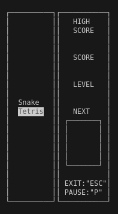
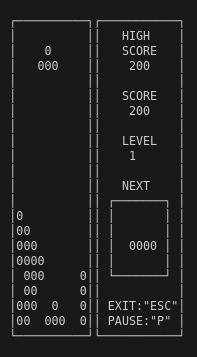
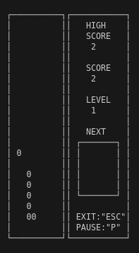
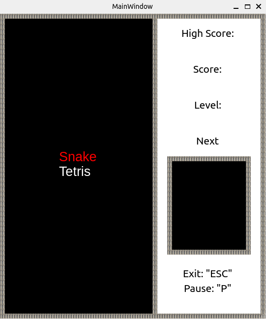
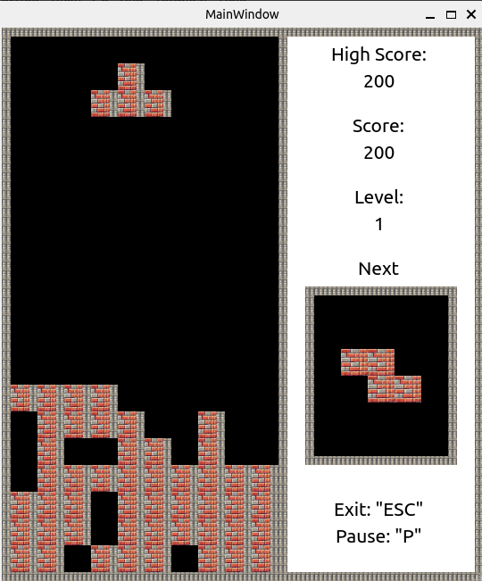
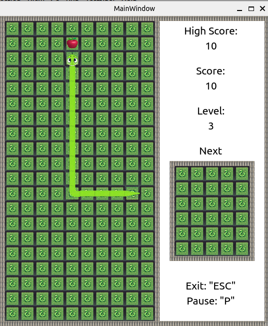

# Содержание

1. [О проекте](#о-проекте)
2. [Принципы разработки](#принципы-разработки)
3. [Графический интерфейс (GUI)](#графический-интерфейс-gui)
4. [Функциональные возможности](#функциональные-возможности)
   - [Игровой процесс](#игровой-процесс)
   - [Подсчет очков](#подсчет-очков)
5. [Скриншоты](#скриншоты)
6. [Используемые инструменты](#используемые-инструменты)
7. [Сборка проекта](#сборка-проекта)
   - [Сборка](#сборка)
   - [Установка](#установка)
   - [Запуск приложений](#запуск-приложений)
   - [Удаление установки](#удаление-установки)
8. [Тестирование](#тестирование)
   - [Запуск тестов](#запуск-тестов)
   - [Отчет о покрытии тестами](#отчет-о-покрытии-тестами)
   - [Проверка утечек памяти](#проверка-утечек-памяти)
9. [Очистка](#очистка)
    - [Очистка объектных файлов и временных файлов](#очистка-объектных-файлов-и-временных-файлов)
    - [Полная очистка](#полная-очистка)
10. [Документация](#документация)
11. [Заключение](#заключение)

# Snake (Змейка)

## О проекте

Этот проект включает две игры: **Snake** (Змейка) и **Tetris**. Змейка написана на C++, а Тетрис — на C. Проект также включает консольный и десктопный интерфейсы, реализованные с использованием паттерна MVC и библиотеки Qt. В данном README описана реализация Змейки, тогда как для Тетриса имеется отдельный [репозиторий](https://github.com/IvanVito/C/tree/main/tetris). 

- **Код программы**:
  - Логика игры Tetris находится в `src/brick_game/tetris`.
  - Логика игры Snake находится в `src/brick_game/snake`.
  - Графический интерфейс в `src/gui/desktop`.
  - Консольный интерфейс в `src/gui/cli`.

- **Сборка**:
  - Управляется через Makefile с целями: `all`, `install`, `uninstall`, `clean`, `dvi`, `dist`, `tests`.

- **Стиль кода**:
  - Используется Google Style.

## Принципы разработки

- **Паттерн MVC**:
  - **Модель**: Содержит бизнес-логику игры.
  - **Контроллер**: Управляет взаимодействием между моделью и представлением.
  - **Представление**: Отвечает за отображение данных и взаимодействие с пользователем.

- **Тестирование**:
  - Логика игры покрыта unit-тестами с использованием Google Test (GTest).
  - Покрытие тестами не менее 94%.

## Графический интерфейс (GUI)

- **Реализация GUI**:
  - Интерфейс игры "Змейка" реализован как в терминальном виде, так и в десктопном на базе Qt.
  - Десктопный интерфейс интегрирован в проект Tetris.

## Функциональные возможности

### Игровой процесс

- **Snake (Змейка)**:
  - Змейка движется по полю и увеличивается в длине при поедании яблок.
  - Победа при достижении длины 200 блоков; поражение — при столкновении с границей или самим собой.
  - Управление стрелками; ускорение зажатой клавишей.
  - Начальная длина змейки — 4 пикселя, размер игрового поля — 10x20 пикселей.
  - Поддержка увеличения скорости и уровней (до 10) при достижении 5 очков.

### Подсчет очков

- Очки начисляются за каждое съеденное яблоко.
- Максимальное количество очков сохраняется между запусками программы.
- Отображение текущих очков и максимального рекорда в боковой панели.

## Скриншоты

<div align="center">



*Терминальное меню*

</div>

<div align="center">



*Терминальный интерфейс тетриса*

</div>

<div align="center">



*Терминальный интерфейс змейки*

</div>

<div align="center">



*Десктопное меню*

</div>

<div align="center">



*Десктопный интерфейс тетриса*

</div>

<div align="center">



*Десктопный интерфейс змейки*

</div>

## Используемые инструменты

- **GCC**: для компиляции проекта.
- **Google Test**: для тестирования.
- **lcov** и **genhtml**: для генерации отчетов о покрытии тестами.
- **Doxygen**: для генерации документации.
- **Valgrind**: для проверки утечек памяти (опционально).

## Сборка проекта

1. **Сборка**:
   - Выполните команду `make` для сборки всех компонентов проекта:
     ```bash
     make
     ```

2. **Установка**:
   - Для установки приложений выполните:
     ```bash
     make install
     ```

3. **Запуск приложений**:
   - **CLI версия**: запустите команду `make play_cli` для запуска терминального интерфейса.
   - **Qt версия**: запустите команду `make play_qt` для запуска Qt-интерфейса.

4. **Удаление установки**

    - Для удаления установленных файлов выполните:
    ```bash
    make uninstall
    ```

## Тестирование

1. **Запуск тестов**:
   - Для выполнения тестов используйте команду:
     ```bash
     make tests
     ```

2. **Отчет о покрытии тестами**:
   - Для генерации отчета о покрытии выполните:
     ```bash
     make gcov_report
     ```

3. **Проверка утечек памяти**:
   - Для проверки утечек памяти выполните:
     ```bash
     make valgrind
     ```

## Очистка

1. **Очистка объектных файлов и временных файлов**:
   - Выполните команду:
     ```bash
     make clean
     ```

2. **Полная очистка**:
   - Для полной очистки выполните:
     ```bash
     make origin
     ```

## Документация

- Для генерации документации используйте команду:
  ```bash
  make dvi
  ```

## Заключение

Игра "Змейка" реализована с учетом всех функциональных требований, включая графический интерфейс, поддержку уровней и подсчет очков. Проект выполнен с использованием паттерна MVC и обеспечивает надежную работу благодаря тестированию и документации.
